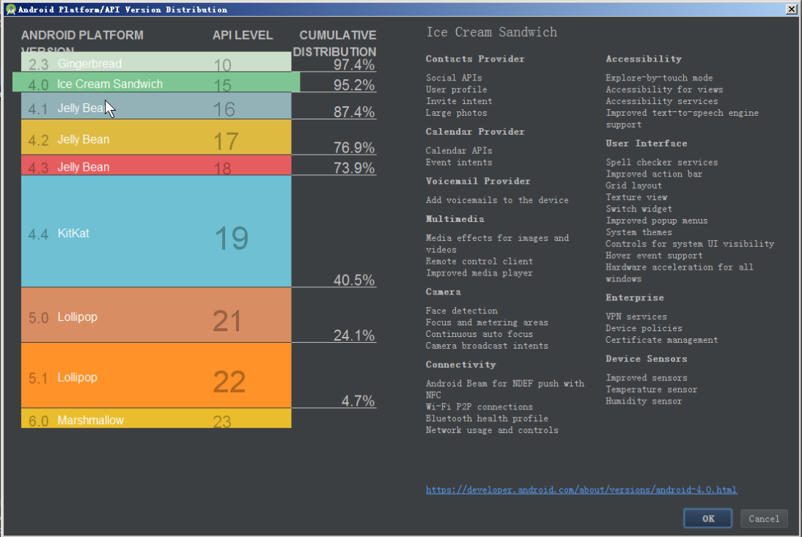
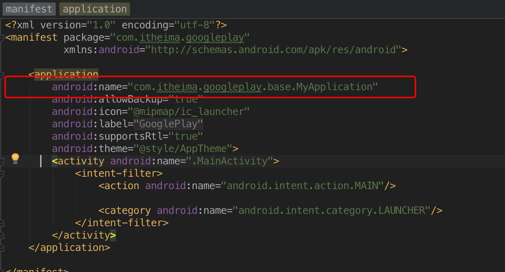
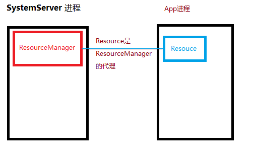

# 创建工程,建立包,书写工具类
## 学习目标
- 列出 MVC 模式的常用包
- 总结 MVC 模式创建包的套路
- 理解 Application 是一个 app 的入口
- 理解 Application 可以作为 app 全局数据保存区
- 分析 Application 对象生命周期和主线程 Handler 对象生命周期
- 理解 Resource 类对象的作用

## 开场白
S:在公司开发常规流程是，效果分析也就是需求分析，需求分析完成后，我们应该设计app的框架，现在我们不这样，这里我们模拟大家第一次做项目，不提前设计框架，而是在做项目的过程中，逐步提取整合框架，那么废话少说，动手开始写代码

E:

## 课堂内容
### 开发步骤
1. 创建工程
2. 建立相关包
3. 书写或者导入一些工具方法
4. 建立svn仓库
5. 纳入svn管理
6. 添加忽略文件
7. 提交代码到仓库中
8. 从svn上checkout项目

### 1创建工程－Mininum SDK 的选择
使用创建 project 向导创建项目的过程中，需要给默认的 app module 配置 mini > sdk，不知道怎么选择的时候可以通过 Help me choose 来提示当前市场上各个版本的比值分布




### 2建立相关包－创建 MVC 项目常见的包
- activity
- fragment
- service
- broadcastReceiver
- conf
- base
- bean
- utils
- views


### 3书写一些工具类－创建 Application 类
####Application 类的两个特点
- 全局唯一
- 生命周期和 App 一样长

#### Application 类的理解
Application 类对象对一个 App 进程来说是全局唯一的，并且生命周期和 App 一样长，所以可以用来保存同样全局唯一的静态数据，但是对于同一 App 的不同的进程，会创建同一个 Application 类的不同对象，因为进程不同，虚拟机就不同，虚拟机创建的对象也不相同。同理静态数据全局唯一的性质也一样，只是对同一个进程有效。


#### 创建 Application 类
  1. 创建 Application 类
  2. 在 Manifest.xml 文件中注册 Application 类


```java
/**
 * 创建者     伍碧林
 * 版权       传智播客.黑马程序员
 * 描述       全局单例
 * 描述       易错点:需要在清单文件里面进行配置
 */
public class MyApplication extends Application {

    private static Context mContext;
    private static Handler mMainThreadHandler;
    private static int mMainThreadId;

    /**
     * 得到上下文
     *
     * @return
     */
    public static Context getContext() {
        return mContext;
    }

    /**
     * 得到主线程里面的创建的一个hanlder
     *
     * @return
     */
    public static Handler getMainThreadHandler() {
        return mMainThreadHandler;
    }

    /**
     * 得到主线程的线程id
     *
     * @return
     */
    public static int getMainThreadId() {
        return mMainThreadId;
    }

    @Override
    public void onCreate() {//程序的入口方法
        //上下文
        mContext = getApplicationContext();

        //主线程的Handler
        mMainThreadHandler = new Handler();

        //主线程的线程id
        mMainThreadId = android.os.Process.myTid();
        /**
         myTid:Thread
         myPid:Process
         myUid:User
         */
        super.onCreate();
    }
}
```



### 4书写相关工具类－创建 UIUtils 类
UIUtils 类主要包含和 UI 相关的操作，比如从资源中获取字符串，从资源中获取字符串数组，从资源中获取颜色 等等，这些功能都离不开 Resource 类
Resource 是 ResourceManager 在客户端的代理类，系统中所有的资源都归 ResourceManager 管理，App 中 res 目录下所有的资源也归 ResourceManager 管理，所以可以通过 ResourceManager 和 资源id 可以获取到资源 id 对应的资源数据



```java
/**
 * 创建者     伍碧林
 * 版权       传智播客.黑马程序员
 * 描述         封装和ui相关的操作
 */
public class UIUtils {
    /**
     * 得到上下文
     */
    public static Context getContext() {
        return MyApplication.getContext();
    }

    /**
     * 得到Resource对象
     */
    public static Resources getResources() {
        return getContext().getResources();
    }

    /**
     * 得到String.xml中的字符串信息
     */
    public static String getString(int resId) {
        return getResources().getString(resId);
    }

    /**
     * 得到String.xml中的字符串数组信息
     */
    public static String[] getStrings(int resId) {
        return getResources().getStringArray(resId);
    }

    /**
     * 得到Color.xml中的颜色信息
     */
    public static int getColor(int resId) {
        return getResources().getColor(resId);
    }

    /**
     * 得到应用程序包名
     *
     * @return
     */
    public static String getPackageName() {
        return getContext().getPackageName();
    }
}
```

### 5Android Studio 使用小技巧
1. 提取成员变量
    菜单: Refactor -> Extract -> Field
    快捷键: ctrl + alt + f 
2. 修改成员变量前缀


## 重点难点讲解

## 问题和练习
### 问题
1. 一个 MVC 架构的 app 常用的包有哪些？
    四大组件、fragment、views、utils、base、net、bean 等等
2. 一个 App 的 Application 对象和 Service 对象哪个先创建？
    Application 先创建
3. 一个 app 的 Application 对象中的数据是否一定是全局唯一的？
    不同进程中的不是，只有同一个进程中的才是
4. 一个 android app 可以有多少个进程，一个进程可以有多少个 android app？
    一个 app 可以有多个进程，一个进程只能有一个 android app
5. 在代码中怎么获取 `/res/drawable` 路径下的一个 Drawable 对象？
    通过 `Drawable Resource.getDrawable(int resId)` 方法获取