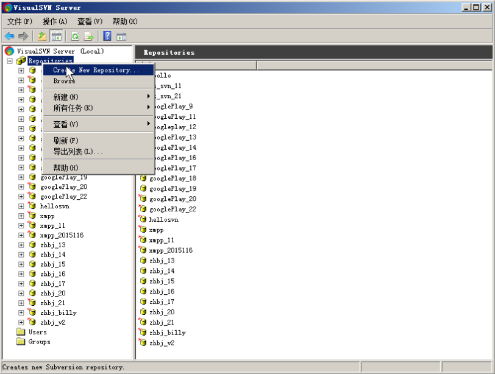
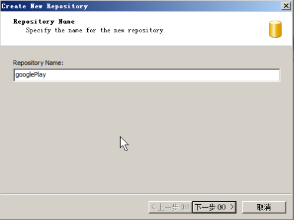
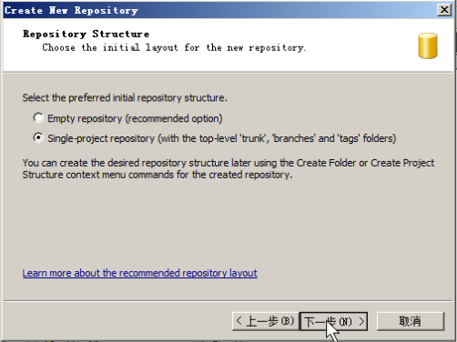
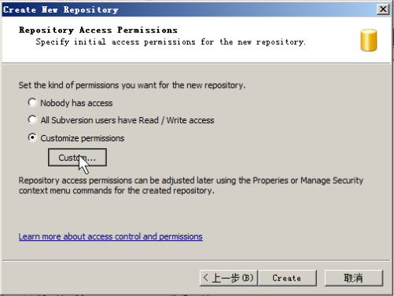
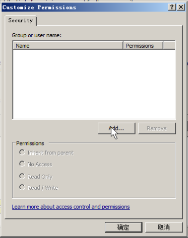
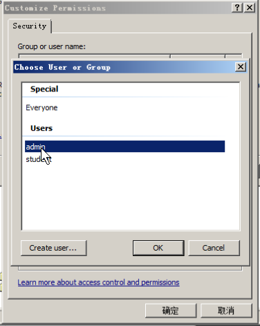
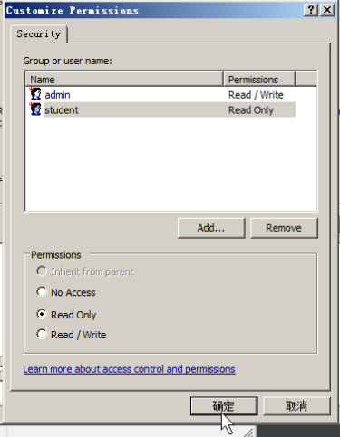
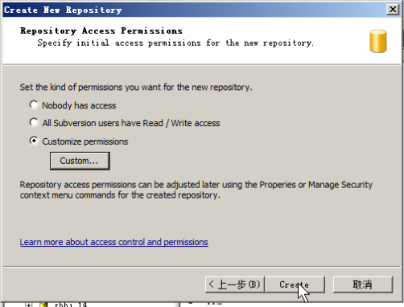
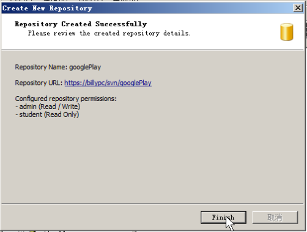
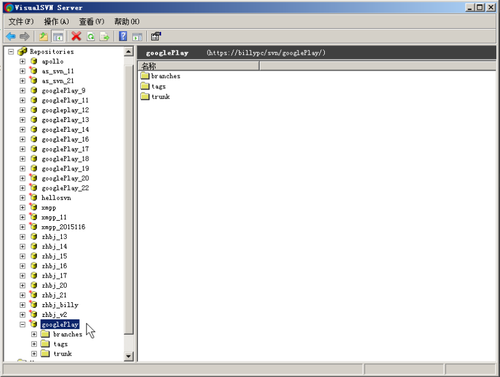

# 01创建 svn 仓库
#### 1. 创建一个新的仓库
打开 VisualSVN Server, 单击 `create new Repository` 创建一个新的仓库

#### 2. 填写仓库的名字

#### 3. 选择仓库的初始化目录结构
选择自带 trunk、tags、branches 目录的结构

#### 4. 配置仓库的访问权限
选择自定义权限，单击 `custom` 按钮

#### 5. 单击 `add` 按钮给仓库访问权限添加用户

#### 6. 双击 `admin` ，给 admin 添加访问权限

#### 7. 设置 admin 为可读可写，设置 student 为只读

#### 8. 单击 `create` 按钮创建仓库

#### 9. 仓库创建完成

#### 10. 查看创建好的仓库
VisualSVN Server 仓库目录中已经存在刚刚创建好的仓库

