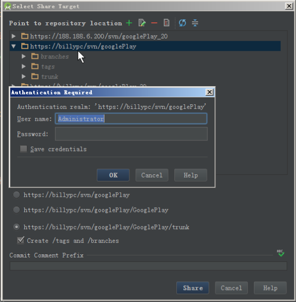

# 02关联项目和仓库
#### 1. 分享项目到仓库

#### 2. 添加仓库的 URL 地址

#### 3. 从 VisualSVN 中 copy 仓库地址

#### 4. 粘贴仓库地址到 Android Studio 中

#### 5. 输入访问仓库的用户名和密码

#### 6. 选中 trunk 目录

#### 7. 建议 tortoiseSVN 安装 1.6 版本，因为高版本提交速度太慢

#### 8. 为 svn 选择本地工作副本为 1.6 版本

#### 9. 正在分享项目到仓库...

#### 10. 分享项目到仓库成功

