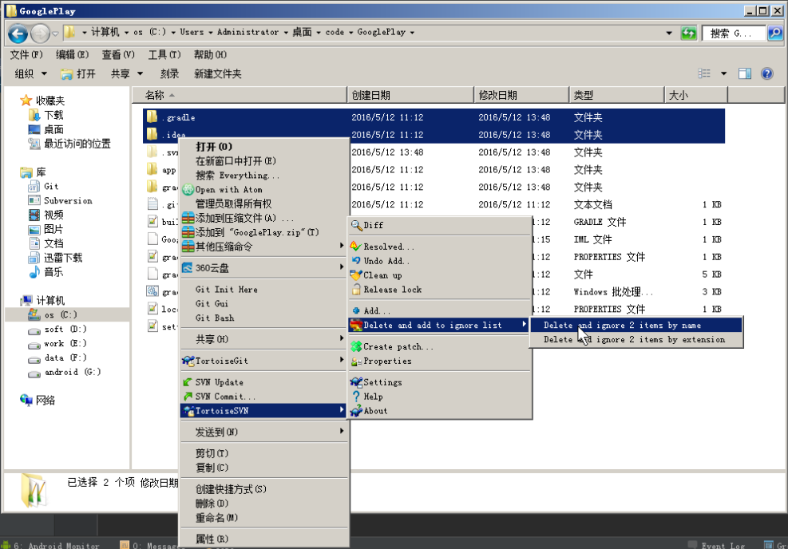
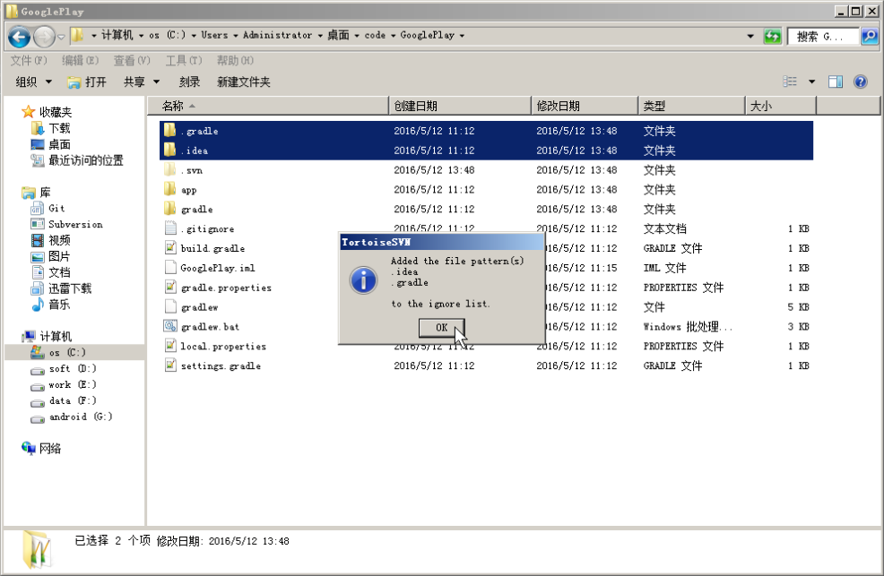
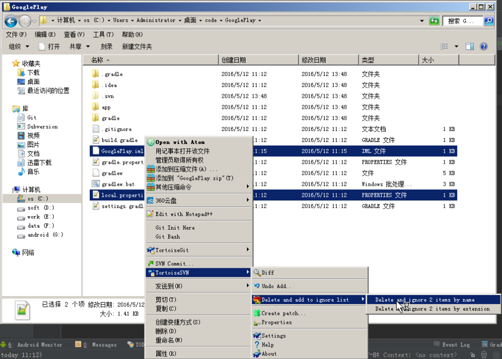
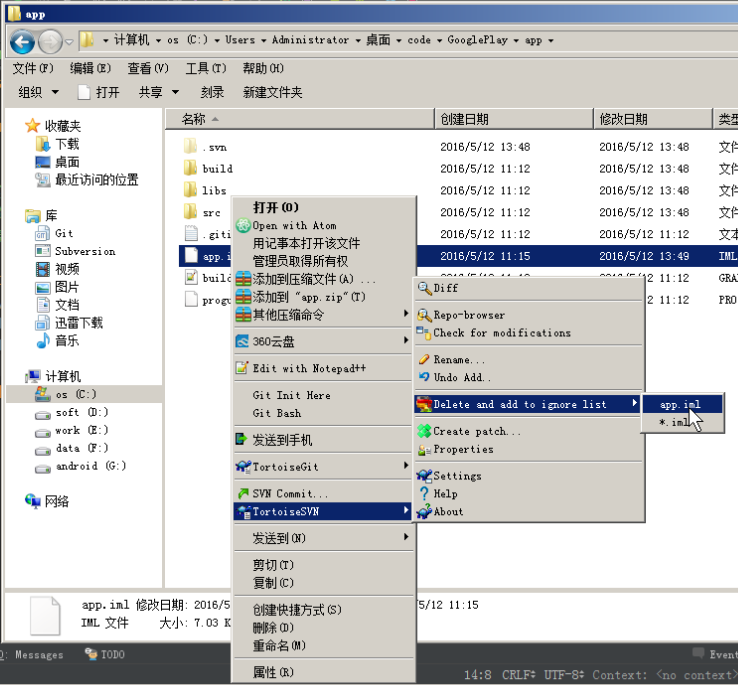
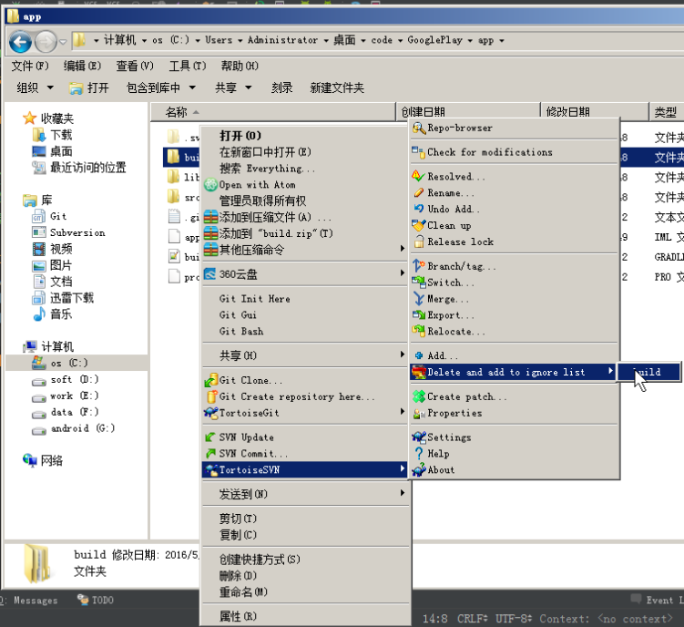

# 03添加忽略版本控制的文件
## 添加忽略文件的原则
- 凡是 idea 可以自动产生的文件都可以添加到 忽略列表
- 凡是和本地环境配置有关的文件都可以添加到 忽略列表

## Android Studio 项目中哪些文件需要添加到忽略列表
- .gradle 目录(自动产生)
- .idea 目录(自动产生)
- 所有的 build 目录(自动产生)
- 所有的 .iml 文件(自动产生)
- local.properties 文件(和本地环境配置有关)
- gradle 目录(可选，自动产生，保存着项目使用的 gradle 程序的版本信息)
- gradle.properties(可选，自动产生，gradle 的配置信息)
- gradlew(可选，自动产生，gradle 任务 shell 脚本文件)
- gradlew.bat(可选，自动产生，gradle 任务批处理文件)

#### 1. 添加 .idea .gradle 文件夹到忽略列表

#### 2. .idea .gradle 文件夹添加到忽略列表成功

#### 3. 添加 GooglePlay.iml 和 local.properties 文件到忽略列表

#### 4. 添加 app module 下 .iml 文件到忽略列表

#### 5. 添加 app module 下 build 目录到忽略列表

