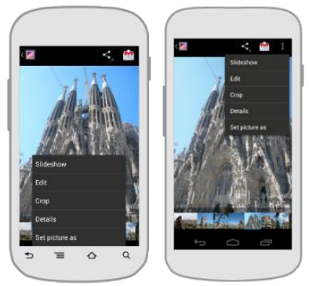
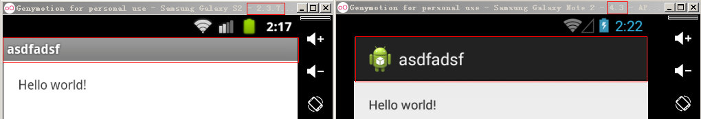

# 07_控制 ActionBar图标部分
## 学习目标
- 回忆 google 引入 ActionBar 的历史原因，理解 ActionBar 的作用
- 列举 ActionBar 的4大组成部分
- 列举支持 Action Bar 的3种情况
- 熟悉 ActionBar API，对 ActionBar 图标部分进行控制的 api 进行归类

## 开场白
S:

E:

## 课堂内容
### 介绍
* Action Bar 是 Google 在 Android 3.0 之后推出的一种全新用户操作方式
* 目的是用来替换掉菜单按键功能，长按操作功能，提供一种全新的操作体验
* 统一界面.方便开发



### Action Bar 4大组成部分


1. **app 图标**：包含了 回退部分，图标，主标题，副标题
2. **视图控件**：允许用户切换视图，视图切换控件的样式有`无视图控件`、`下拉菜单`、`选项卡`对应了`标准`，`list`，`tab` 3种视图导航模式
3. **操作按钮**：在操作栏里，展示出 app 中最重要的操作。不能展示在操作栏里的操作，可以自动移到“更多操作”里
4. **更多操作**：把不常用的操作放到更多操作里

效果参考 `apidemo` -> `app` -> `Action Bar`
- Action Bar Tabs
- Action Bar Usage
- Display Options

### 如何支持 Action Bar
1. android sdk 3.0之后默认支持 Action Bar
2. 市面上也有开源的actionbarSherlock可以支持ActionBar
3. google 2013 i/o大会.在v7(api level 7_android2.1以上)中对actionbar进行了兼容;



### 控制 ActionBar 标题图标
#### 设置title,返回按钮,logo
+ 获得actionbar
+ 设置主标题
+ 设置子标题
+ 设置icon
+ 设置logo
+ 设置icon和logo的优先级
+ 设置是否显示logo
+ 设置是否显示title
+ 设置是否显示返回按钮

#### 相关Api
1. 设置显示数据
2. 设置显示选项

```java
// 获取ActionBar
mActionBar = getSupportActionBar();

mActionBar.setTitle("MainTitle");// 设置主title部分
mActionBar.setSubtitle("SubTitle");// 设置子title部分

mActionBar.setIcon(R.drawable.ic_launcher);// 设置应用图标
mActionBar.setLogo(R.mipmap.ic_action_call);

// 设置 Action Bar 显示选项
mActionBar.setDisplayShowTitleEnabled(true);// 设置标题是否可见
mActionBar.setDisplayShowHomeEnabled(true);// 设置应用图标是否显示
mActionBar.setDisplayUseLogoEnabled(false);// 设置是否显示Logo优先
mActionBar.setDisplayHomeAsUpEnabled(true);// 设置back按钮是否可见
```

## 重点难点讲解

## 问题和练习
### 问题
1. ActionBar 有什么作用？
2. ActionBar 由哪4个部分组成？
3. 哪些条件下可以使用 ActionBar？ 
4. ActionBar 图标相关 api 可以分为哪2类？

### 练习
1. 实现一个带 ActionBar 的 app
    - ActionBar 的标题为`黑马`，子标题为`双元`
    - 提供一个 Button，点击 Button 可以实现 icon 和 logo 切换显示
    - 提供一个 Button，点击 Button 可以实现 home 图标的隐藏和显示
    - 提供一个 Button，点击 Button 可以实现 Title 的隐藏和显示
    - 提供一个 Button，点击 Button 可以实现 back 按钮的隐藏和显示
    - 把结果提交到 svn 仓库


