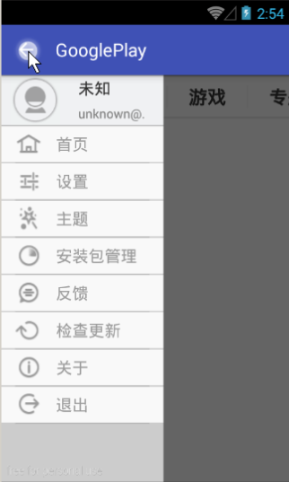

# 实现侧拉菜单
## 学习目标
- 理解 DrawerLayout 的作用
- 分析 DrawerLayout 的实现原理
- 使用 DrawerLayout 实现侧拉菜单
- 理解 ActionBarDrawerToggle 的作用
- 实现 ActionBar 和 DrawerLayout 联动

## 开堂白
S:

E:

## 课堂内容
### 使用 DrawerLayout 实现侧拉菜单
#### 1. 在 module 的 gradle 文件中添加 v4 包的依赖
如果已经在 gradle 文件中使用 compile 添加 v7 包依赖(从 maven 服务器下载依赖包)，可以不用添加 v4 包的依赖

- compile 是从 maven 服务器下载依赖包
- compile project 是添加一个本地项目依赖
- compile files 是添加一个本地 library 文件依赖

```java
dependencies {
    compile fileTree(dir: 'libs', include: ['*.jar'])
    testCompile 'junit:junit:4.12'
    compile 'com.android.support:appcompat-v7:23.3.0'
    compile 'com.android.support:support-v4:23.3.0'
    compile project(':PagerSlidingTabStrip_Lib')
    compile files('libs/butterknife-6.0.0.jar')
}
```
  
#### 2. 在 layout 文件中使用 DrawerLayout
在 DrawerLayout 中添加菜单布局和内容布局，菜单布局的 layout_gravity 属性为 left|right

```xml
<?xml version="1.0" encoding="utf-8"?>
<android.support.v4.widget.DrawerLayout
    android:id="@+id/main_drawerLayout"
    xmlns:android="http://schemas.android.com/apk/res/android"
    xmlns:itheima="http://schemas.android.com/apk/res-auto"
    xmlns:tools="http://schemas.android.com/tools"
    android:layout_width="match_parent"
    android:layout_height="match_parent"
    tools:context="com.itheima.googleplay.MainActivity">
    <!--菜单区域(右菜单)-->
    <FrameLayout
        android:layout_width="180dp"
        android:layout_height="match_parent"
        android:layout_gravity="right"
        android:background="#0f0" />
    <!--菜单区域(左菜单)-->
    <FrameLayout
        android:layout_width="180dp"
        android:layout_height="match_parent"
        android:layout_gravity="left"
        android:background="#f00" />
    <!--内容区域-->
    <LinearLayout
        android:layout_width="match_parent"
        android:layout_height="match_parent"
        android:orientation="vertical">
    </LinearLayout>
</android.support.v4.widget.DrawerLayout>
```

### 实现 ActionBar 和 DrawerLayout 联动
使用 ActionBarDrawerToggle 实现 ActionBar 和 DrawerLayout 联动

  


1. new ActionBarDrawerToggle 对象(v7包和v4包都有ActionBarDrawerToggle，注意使用 v7 包中的，v4 包中的不能实现 ⬅️ 和 汉堡包 切换)
2. 同步 ActionBar 和 DrawerLayout 的打开关闭状态，同步成功可以使 ⬅️ 变为汉堡包
3. 使用 ActionBarDrawerToggle 监听 DrawerLayout 的滑动
4. 处理 ActionBar home 按钮点击事件

```java
private void initActionBarDrawerToggle() {
    // ActionBarDrawerToggle(Activity activity, DrawerLayout drawerLayout, int openDrawerContentDescRes, int closeDrawerContentDescRes)
    // activity ActionBar 所在的 Activity 对象
    // drawerLayout ActionBar 要关联的 DrawerLayout 对象
    // openDrawerContentDescRes 打开的时候对身体缺陷用户的提示文字(可选)
    // closeDrawerContentDescRes 关闭的时候对身体缺陷用户的提示文字(可选)
    mToggle = new ActionBarDrawerToggle(this, mDrawerLayout, R.string.open, R.string.close);

    // 同步状态方法-->替换默认回退部分的UI效果
    mToggle.syncState();

    // 设置drawerLayout的监听-->DrawerLayout拖动的时候,toggle可以跟着改变ui
    mDrawerLayout.setDrawerListener(mToggle);
}

@Override
public boolean onOptionsItemSelected(MenuItem item) {
    switch (item.getItemId()) {
        case android.R.id.home:
            // 点击toggle可以控制drawerlayout的打开和关闭
            mToggle.onOptionsItemSelected(item);
            break;

        default:
            break;
    }
    return super.onOptionsItemSelected(item);
}
```

## 重点难点讲解

## 问题和练习
### 问题
1. 说出 DrawerLayout 的作用
2. 说出 DrawerLayout 和 SlidingMenu 的区别
3. 猜想 DrawerLayout 的实现原理
4. 说出 ActionBarDrawerToggle 的作用

### 练习
1. 使用 DrawerLayout 实现侧拉菜单
2. 实现 ActionBar 和 DrawerLayout 侧拉菜单联动
