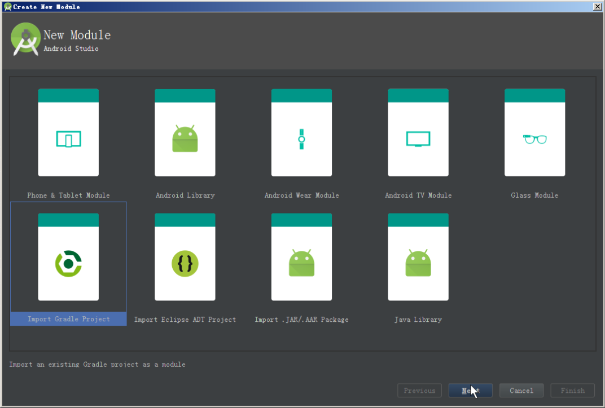
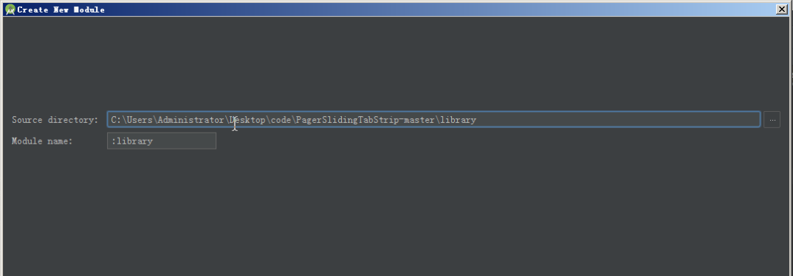
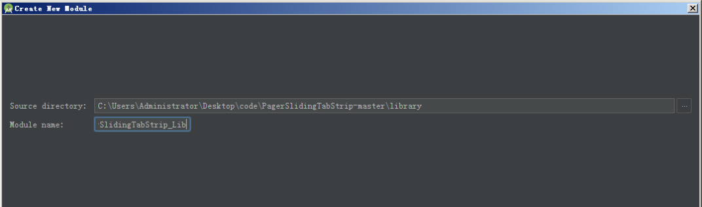
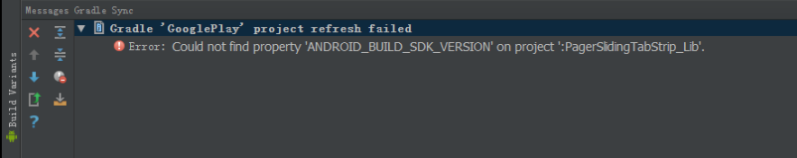
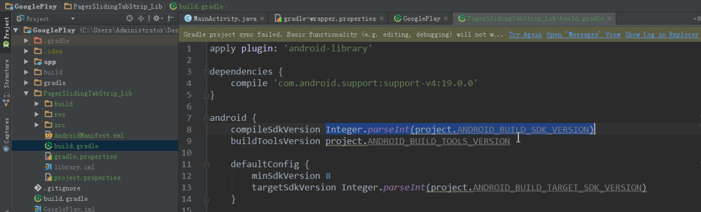
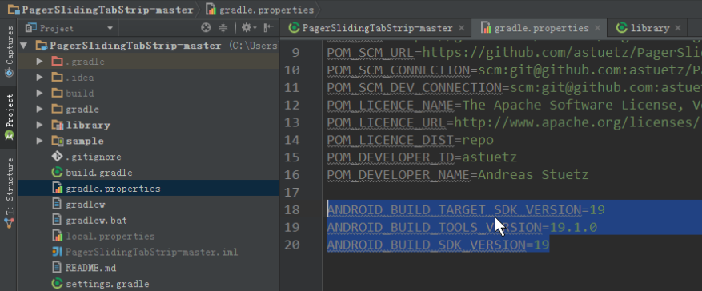

# 04引入到GooglePlay中
#### 1. 打开 Android Studio 选择导入 module

#### 2. 选择 module 路径

#### 3. (可选)修改 module 的名字

#### 4. 解决常见问题

##### 1. 属性找不到
module 的 build.gradle 脚本文件中的使用的 project.propertyName 属性找不到，可以在 gradle.properties 文件中使用键值对定义, 在 gradle.properties 文件中声明的属性都是字符串类型的

