# 0902导入项目运行Demo
#### 1. 解压项目压缩文件到非中文路径
因为 android studio 项目不能包含中文路径

#### 2. 删掉项目文件夹中的 gradle 文件夹
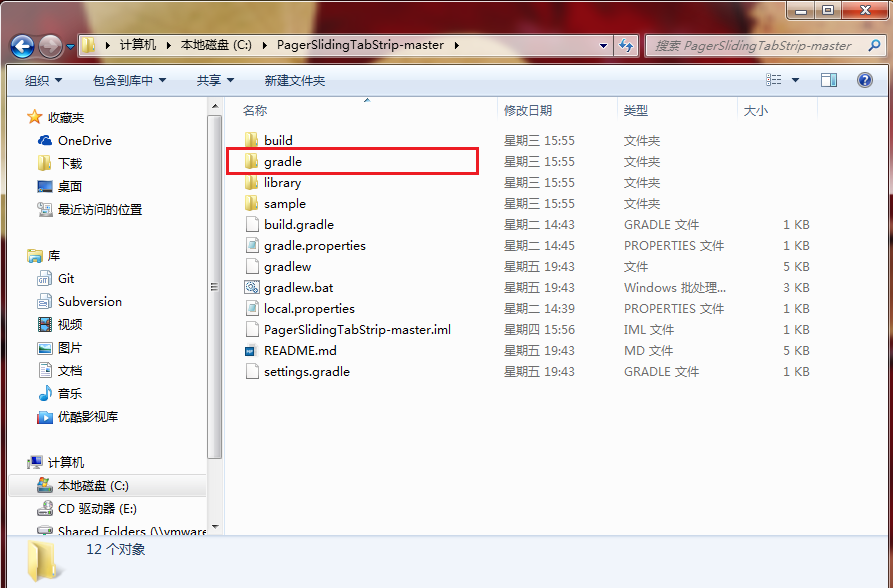

如果不删掉，并且没有联网，打开一个项目可能一直在下面这个界面等待

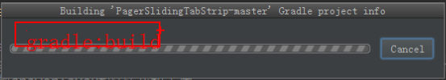

#### 3. 使用 android studio 打开项目

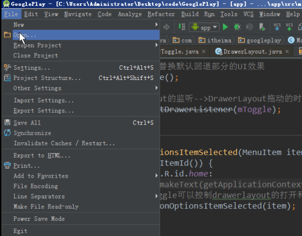
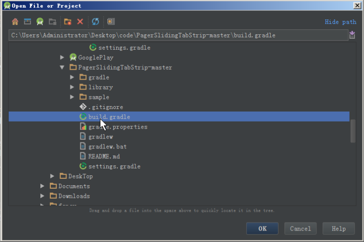

如果出现这个错误，是因为项目中 local.properties 文件里面配置的 sdk 路径和本地的 sdk 路径不同，这里直接点 `ok` 按钮就好

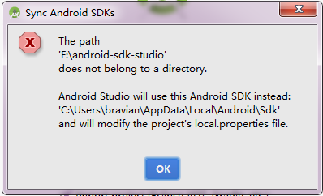

#### 4. 配置 gradle
选择 gradle wrapper 或者 local gradle，选择 `OK` 按钮就是使用 gradle wrapper，选择 `cancle` 按钮就是使用 local gradle，目前没发联网，我们一般选择 cancle

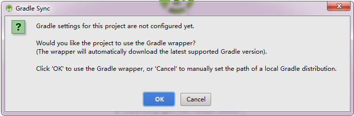

填写本地 gradle 程序的路径，一般 android studio 安装好之后，在 android studio 安装目录中自带 gradle 程序

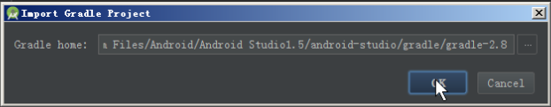

#### 5. 解决常见问题
##### 1. gradle 插件不可用
如果出现如下图所示 gradle 插件不可用，可以修改 project 目录中的 build.gradle 文件里的该插件的版本
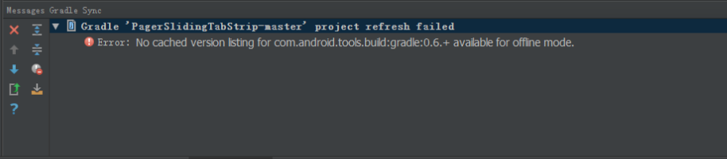
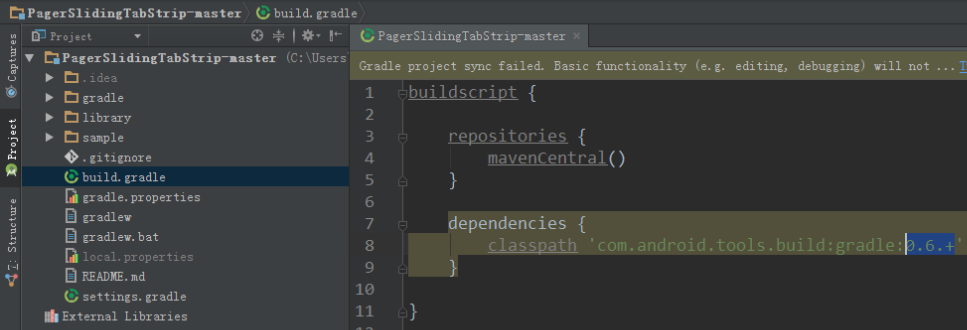

##### 2. 删掉上传项目到 maven 仓库的 gradle 插件的引用

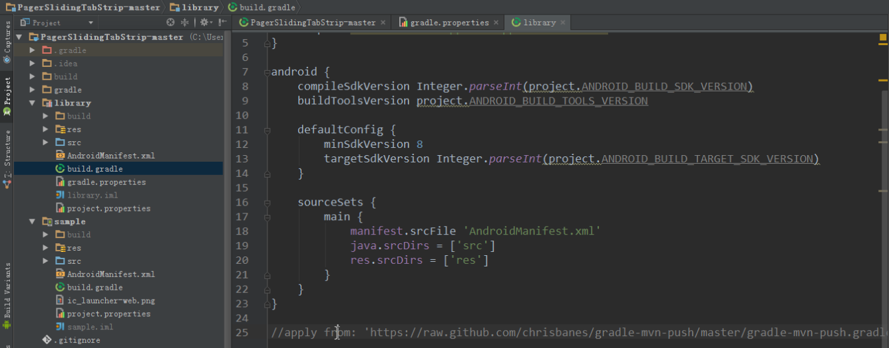

#### 6. 导入成功
导入成功，application 类型的 module 有个手机图标， library 类型的 module 有个书本图标

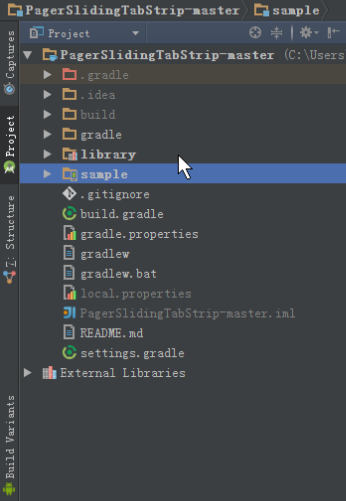
