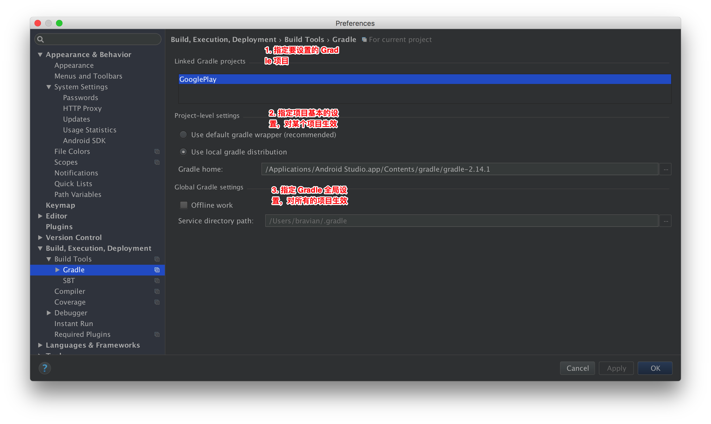

# github 上开源项目的下载和使用
## 学习目标
- 理解 PagerSlidingTabStrip 库的作用
- 理解 android 项目的构建流程
- 理解 gradle 在 android studio 构建项目的作用
- 理解 gradle wrapper 配置和 local gradle 配置
- 正确导入 github 上的开源项目，解决导入项目过程中碰到的问题

## 开场白
S:

E:导入一个 github 上的项目，可能会碰到的问题，各种各样，我们在课上不可能都演示一遍，大家在学习的过程中碰到什么问题，要学会分析问题，解决问题。其实老师刚刚开始使用 android studio 的时候也碰到非常多的问题，我就碰到一个问题解决一个问题，慢慢积累发现，绝大部分问题我都可以看懂了，实在搞不定，就 Google 或者 百度一下。给大家 5 分钟，把 PagerSlidingTabStrip 项目打开，并运行起来看看效果，然后给 GooglePlay 添加上 PagerSlidingTabStrip 依赖

## 课堂内容
### 1. PagerSlidingTabStrip 下载
[步骤详情](09.01PagerSlidingTabStrip下载.html)

### 2. 导入项目运行Demo
[步骤详情](09.02导入项目运行Demo.html)

### 3. 查看效果
[步骤详情](09.03查看效果.html)

### 4. 引入到GooglePlay中
[步骤详情](09.04引入到GooglePlay中.html)

## 重点难点讲解
### 1. android 构建流程

### 2. gradle 在 android 构建过程中的作用
gradle 是一个程序，gradle 执行 gradle 脚本，就可以可以让构建过程自动化

### 3. gradle 设置

## 问题和练习
### 问题
1. PagerSlidingTabStrip 有什么作用
2. 说说一个 android 项目的构建包含哪些步骤

### 练习
1. 导入 PagerSlidingTabStrip 项目
2. 给 GooglePlay 添加 PagerSlidingTabStrip Library 形式的依赖

