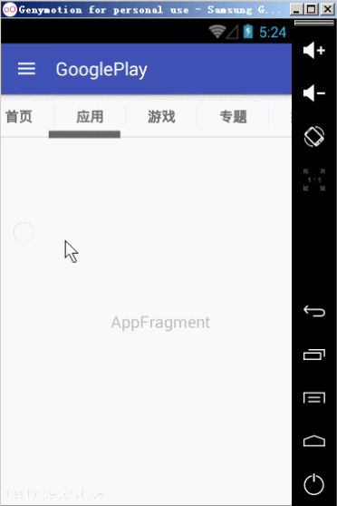

# 为ViewPager和PSTS设置数据
## 学习目标
- 使用 Fragment 给 ViewPager 设置页面数据
- 使用 PagerSlidingTabStrip 和 ViewPager 实现带 tab 栏的滑动页面
- 理解工厂模式的作用

## 开场白
S:

E:



## 课堂内容
### 通过工厂设计模式创建Fragment对象
#### 1.创建工厂类
FragmentFactory 工厂类专门负责创建 Fragment 对象，把创建 Fragment 对象的功能封装到工厂类的内部，假设创建 Fragment 对象的逻辑需要修改，也只需要修改工厂类中的代码，而不需要修改使用工厂类的目标类 PagerAdapter 的代码，这就是封装变化，隔离变化思想的体现

```java
**
 * 描述         封装对Fragment的创建
 */
public class FragmentFactory {
    public static final int FRAGMENT_HOME = 0;//首页
    public static final int FRAGMENT_APP = 1;//应用
    public static final int FRAGMENT_GAME = 2;//游戏
    public static final int FRAGMENT_SUBJECT = 3;//专题
    public static final int FRAGMENT_RECOMMEND = 4;//推荐
    public static final int FRAGMENT_CATEGORY = 5;//分类
    public static final int FRAGMENT_HOT = 6;//排行

    public static Fragment createFragment(int position) {
        //定义Fragment对象
        Fragment fragment = null;

        switch (position) {
            case FRAGMENT_HOME://返回 首页 对应的fragment
                fragment = new HomeFragment();
                break;
            case FRAGMENT_APP://返回 应用 对应的fragment
                fragment = new AppFragment();
                break;
            case FRAGMENT_GAME://返回 游戏 对应的fragment
                fragment = new GameFragment();
                break;
            case FRAGMENT_SUBJECT://返回 专题 对应的fragment
                fragment = new SubjectFragment();
                break;
            case FRAGMENT_RECOMMEND://返回 推荐 对应的fragment
                fragment = new RecommendFragment();
                break;
            case FRAGMENT_CATEGORY://返回 分类 对应的fragment
                fragment = new CategoryFragment();
                break;
            case FRAGMENT_HOT://返回 排行 对应的fragment
                fragment = new HotFragment();
                break;

            default:
                break;
        }
        return fragment;
    }
}
```

#### 2.定义对应的 Fragment 类
创建 fragment 类
    + HomeFragment
    + AppFragment
    + GameFragment
    + SubjectFragment
    + RecommendFragment
    + CategoryFragment
    + HotFragment

```java
public class HomeFragment extends android.support.v4.app.Fragment {
    @Nullable
    @Override
    public View onCreateView(LayoutInflater inflater, ViewGroup container, Bundle savedInstanceState) {
        TextView tv = new TextView(UIUtils.getContext());
        tv.setGravity(Gravity.CENTER);
        tv.setText(this.getClass().getSimpleName());//"HomeFragment"
        return tv;
    }
}
```

### 为ViewPager设置Adapter
#### 1. 添加 title 栏数据
在 res/values/strings.xml 文件中添加字符串数组数据定义

```xml
<string-array name="main_titles">
    <item>首页</item>
    <item>应用</item>
    <item>游戏</item>
    <item>专题</item>
    <item>推荐</item>
    <item>分类</item>
    <item>排行</item>
</string-array>
```

#### 2. 定义 MainPagerAdapter 类

```java
/**
 * PagerAdapter-->View
 * FragmentStatePagerAdapter-->Fragment
 * FragmentPagerAdapter-->Fragment
 */
class MainFragmentPagerAdapter extends FragmentPagerAdapter {

    public MainFragmentPagerAdapter(FragmentManager fm) {
        super(fm);
    }

    @Override
    public Fragment getItem(int position) {//指定Position所对应的页面的Fragment内容
        LogUtils.s("初始化->" + mMainTitles[position]);
        Fragment fragment = FragmentFactory.createFragment(position);
        return fragment;
    }

    @Override
    public int getCount() {//决定ViewPager页数的总和
        if (mMainTitles != null) {
            return mMainTitles.length;
        }
        return 0;
    }
}
```

#### 3. 创建 MainPagerAdapter 类对象

```java
public void initData() {
    //模拟数据集
    mMainTitles = UIUtils.getStrings(R.array.main_titles);

    //为viewPager设置适配器
    MainFragmentPagerAdapter adapter = new MainFragmentPagerAdapter(getSupportFragmentManager());
    mMainViewpager.setAdapter(adapter);
}
```

### PSTS和ViewPager进行绑定
#### 1. 给PSTS设置ViewPager对象

```java
public void initData() {

    ......

    // Bind the tabs to the ViewPager
    mMainTabs.setViewPager(mMainViewpager);
}
```

#### 2. 重写Adapter的getPageTitle方法

```java
/**
 * PagerAdapter-->View
 * FragmentStatePagerAdapter-->Fragment
 * FragmentPagerAdapter-->Fragment
 */
class MainFragmentPagerAdapter extends FragmentPagerAdapter {
    
     ......

    /**
     * 必须覆写一个方法:getPageTitle
     */
    @Override
    public CharSequence getPageTitle(int position) {
        return mMainTitles[position];
    }
}
```

## 重点难点讲解

## 问题和练习
### 问题
1. 工厂模式有什么作用

### 练习
1. 使用 PagerslidingTabStrip 和 ViewPager 实现带 tab 栏的滑动页面
